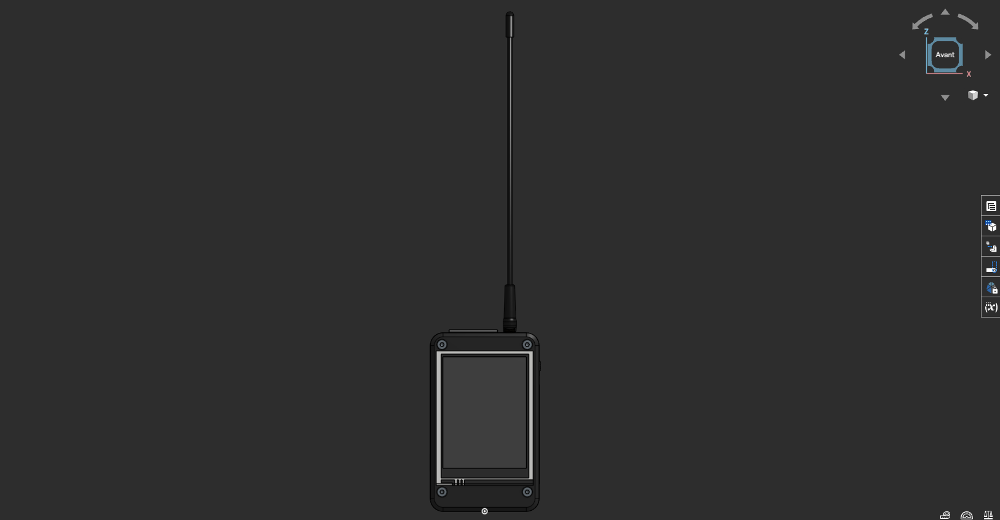
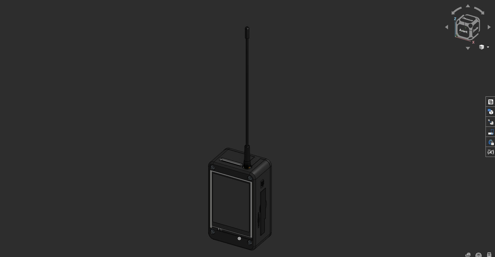
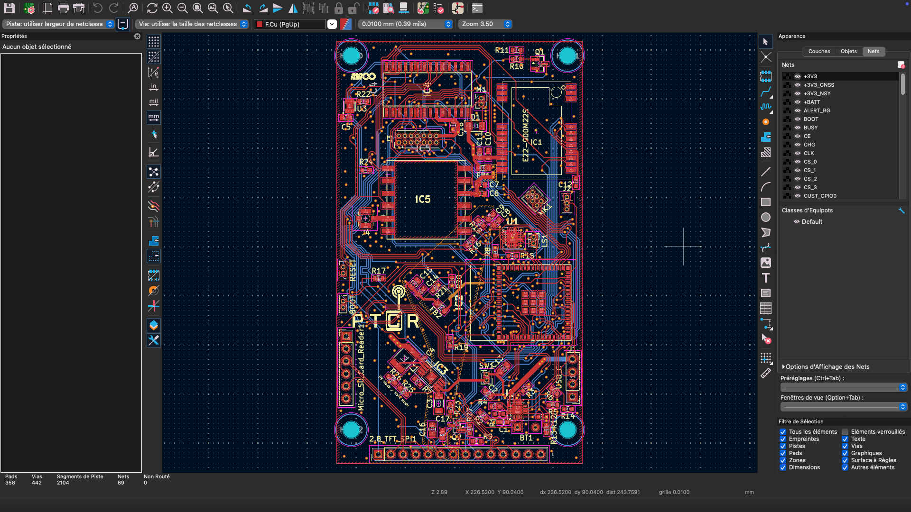
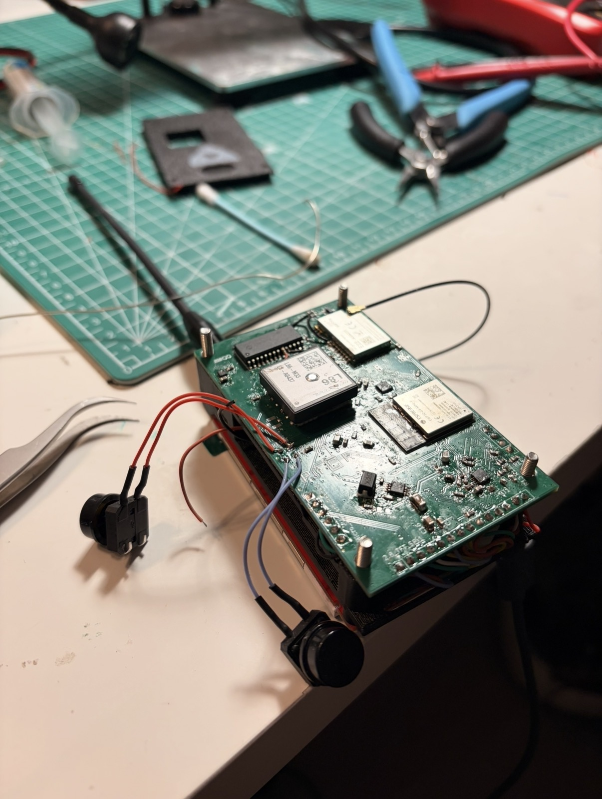
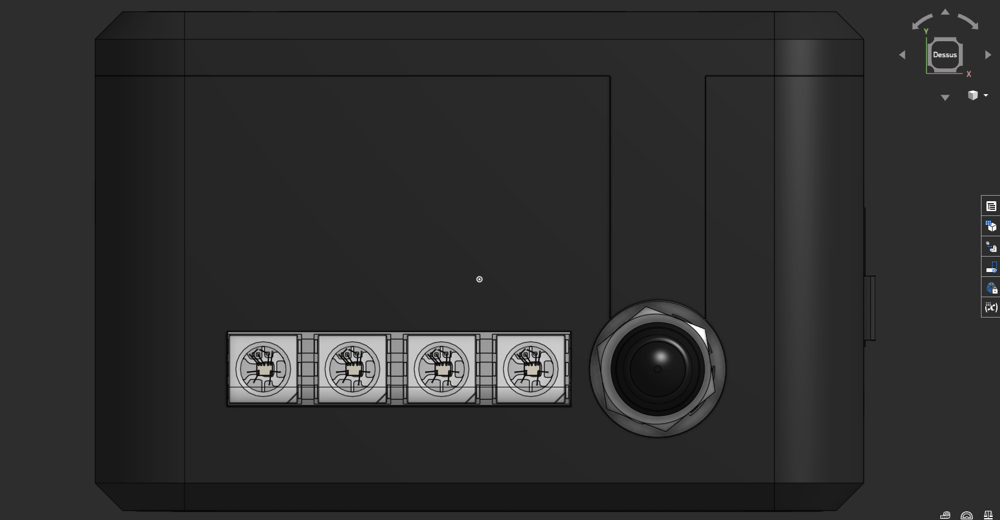
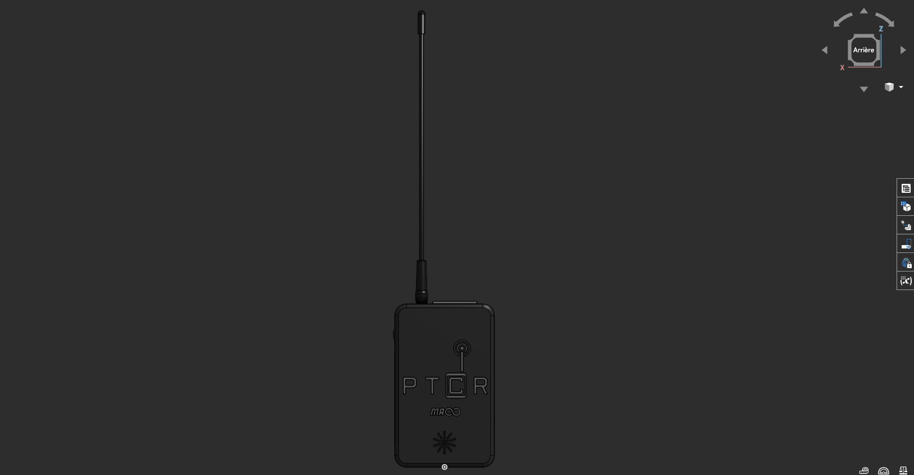
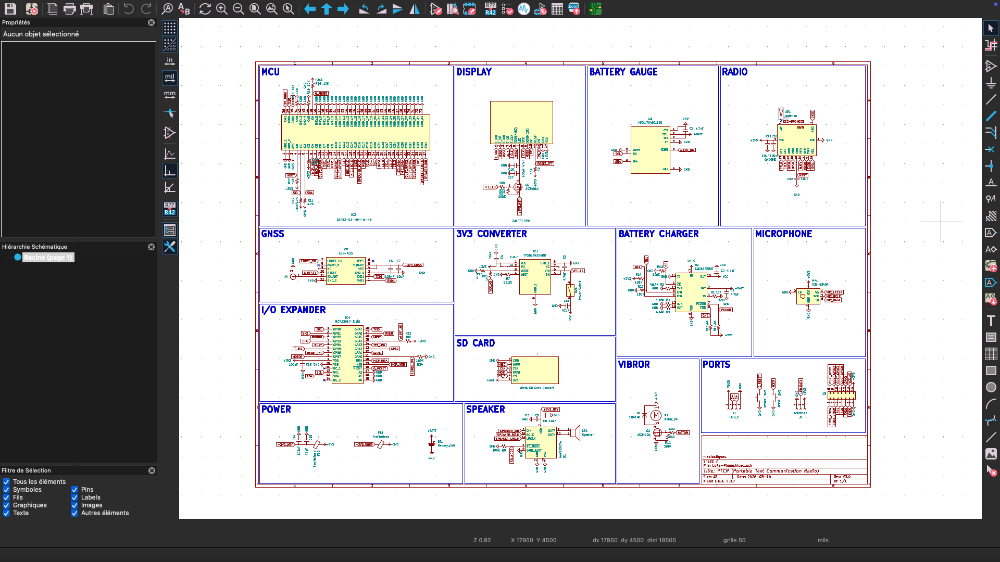

# PTCR -- Portable Text Communication Radio

PTCR (**Portable Text Communication Radio**) is an open hardware
LoRa-based handheld communication device designed for off‑grid
messaging.

The goal of this project is to build a **fully self‑contained radio
communicator** that can operate without cellular infrastructure,
allowing users to exchange text messages over long distances using LoRa
technology.

This project was created by **Maël**, a developer and hardware tinkerer
who enjoys:

-   hiking
-   autonomy and off‑grid systems
-   nomadic lifestyles
-   building and experimenting with electronics
-   creating whatever ideas come to mind

The idea behind PTCR came from the desire to have a **nomadic
communication tool** that works during hikes, expeditions, or remote
travel --- without relying on mobile networks.

Instead of buying a commercial device, the obvious solution was to
**build one**.

------------------------------------------------------------------------

# Device Preview

 *Front view of the device*

 *Side view / enclosure details*

 *Internal electronics*

 *Prototype board*

 *Top of the device*

 *Back of the device*

------------------------------------------------------------------------

# Features

-   **LoRa long‑range communication**
-   **GNSS positioning (GPS / GLONASS)**
-   **SPI TFT display**
-   **microSD storage**
-   **LiPo battery powered**
-   **High‑efficiency 3.3V buck regulator**
-   **Open hardware**
-   Designed for **off‑grid and nomadic use**

------------------------------------------------------------------------

# Hardware Overview

The system is built around several main components:

  Component      Role
  -------------- --------------------------
  ESP32‑S3       Main MCU
  E22‑900M22S    LoRa radio module
  Quectel L86    GNSS receiver
  MCP23017       I²C GPIO expander
  TFT display    User interface
  microSD        Data storage
  TPS62842       3.3V switching regulator
  LiPo battery   Power source

The PCB uses a **4‑layer stackup**:

-   Top layer: signals
-   Internal layer: **solid ground plane**
-   Internal layer: **3.3V power plane**
-   Bottom layer: signals + ground pour

This architecture improves signal integrity and RF performance.

------------------------------------------------------------------------

# Schematic

------------------------------------------------------------------------

# Pin Mapping

## LoRa Module -- E22‑900M22S

  Signal   Direction    Description
  -------- ------------ ----------------------
  MISO     LoRa → MCU   SPI data from radio
  MOSI     MCU → LoRa   SPI data to radio
  SCK      MCU → LoRa   SPI clock
  NSS      MCU → LoRa   Chip select
  BUSY     LoRa → MCU   Radio busy indicator
  DIO1     LoRa → MCU   Interrupt
  RXEN     MCU → LoRa   Enable RX
  TXEN     MCU → LoRa   Enable TX
  NRST     MCU → LoRa   Reset

RXEN and TXEN are pulled down by default to guarantee a safe startup
state.

------------------------------------------------------------------------

## GNSS -- Quectel L86

  Signal   Direction       Description
  -------- --------------- ---------------
  TX       GNSS → MCU      NMEA output
  RX       MCU → GNSS      configuration
  V_BCKP   backup supply   RTC retention

------------------------------------------------------------------------

## MCP23017 -- GPIO Expander

Connected through **I²C**.

  Signal       Description
  ------------ ---------------
  SDA          I²C data
  SCL          I²C clock
  GPA0--GPA7   extended GPIO
  GPB0--GPB7   extended GPIO

Used for additional control signals and hardware expansion.

------------------------------------------------------------------------

## TFT Display (SPI)

  Signal   Description
  -------- ----------------
  MOSI     SPI data
  SCK      SPI clock
  CS       Chip select
  DC       Data / command
  RST      Reset
  BL       Backlight

------------------------------------------------------------------------

## microSD

  Signal   Description
  -------- -------------
  MOSI     SPI data
  MISO     SPI data
  SCK      SPI clock
  CS       Chip select

Shared SPI bus with other peripherals.

------------------------------------------------------------------------

# Power System

Power is supplied by a **single‑cell LiPo battery**.

A **TPS62842 buck converter** generates the **3.3V system rail**.

The design includes:

-   local decoupling capacitors
-   ferrite filtering
-   ground stitching vias
-   separated noisy power domains

This ensures stable operation for RF, GNSS, and digital circuits.

------------------------------------------------------------------------

# Firmware (planned)

The ESP32 firmware will provide:

-   LoRa messaging
-   device‑to‑device communication
-   contact management
-   message history on SD card
-   GNSS position logging
-   graphical interface on TFT

Future ideas:

-   mesh networking
-   encrypted messaging
-   APRS beacon support
-   offline mapping

------------------------------------------------------------------------

# Motivation

This project combines several things I enjoy:

-   hiking
-   autonomy and self‑reliance
-   radio communication
-   embedded electronics
-   building experimental devices

PTCR is meant to be a **portable communication device for nomadic use**,
especially when exploring places without network coverage.

And most importantly --- it was simply fun to build.

------------------------------------------------------------------------

# Project Status

Prototype stage !

Current revision: **PTCR V3**

Hardware and firmware are actively being developed.

------------------------------------------------------------------------

# Author

**Maël CUNY**

Software developer, robotics enthusiast, and hardware builder.
